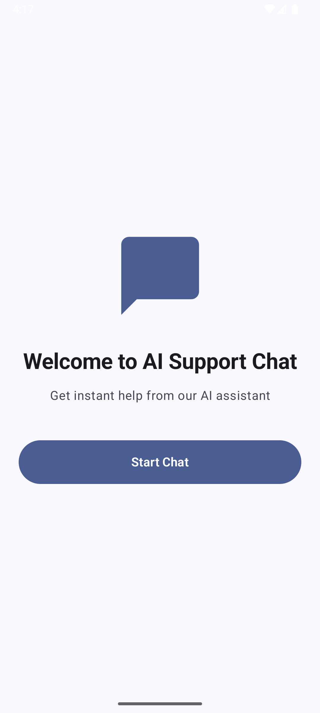
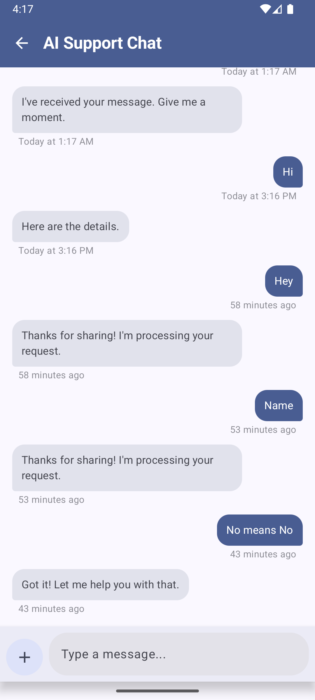
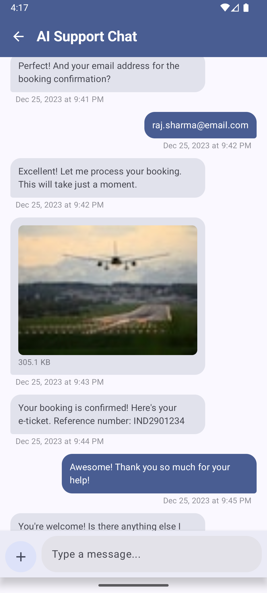

# Chat Message Viewer - Android App 💬

A modern, feature-rich chat interface built with Jetpack Compose demonstrating clean architecture, smooth animations, and Android development best practices.

## 📱 Overview

This is a fully functional chat application that showcases a conversation between a user and an AI support agent. The app features local data persistence, image attachments, smart pagination, and delightful animations throughout the user experience.

**Key Highlights:**
- Clean Architecture with MVVM pattern
- Efficient pagination (loads 10 messages at a time)
- Real-time typing indicators
- Smart timestamp formatting
- Full-screen image viewer with pinch-to-zoom
- Material3 design with dynamic theming

---

📱 Screenshots & Demo
### Home Screen


### Chat Screen
<div style="display: flex; gap: 10px;">
  
  
</div>

## ✨ Features

### Core Features ✅
| Feature | Description |
|---------|-------------|
| **Text Messages** | Send and receive text messages with proper alignment |
| **Image Attachments** | Pick images from gallery with file size display |
| **Local Persistence** | Room Database stores all messages locally |
| **Auto-scroll** | Always shows latest messages on load and send |
| **Full-screen Viewer** | Tap images to view full-screen with pinch-to-zoom |
| **Seed Data** | Pre-populated with 25 sample messages on first launch |


**Efficient Pagination**
- Loads only 10 most recent messages initially
- Auto-loads older messages when scrolling to top
- Small loading indicator during pagination
- Maintains scroll position
- 3x faster initial load time

---

## 🏗️ Architecture

This project follows **Clean Architecture** principles with clear separation of concerns:

```
┌─────────────────────────────────────────────┐
│         Presentation Layer                  │
│   (Compose UI + ViewModels + Navigation)    │
├─────────────────────────────────────────────┤
│            Domain Layer                     │
│  (Use Cases + Models + Repository Interface)│
├─────────────────────────────────────────────┤
│             Data Layer                      │
│   (Room Database + Repository Impl)         │
└─────────────────────────────────────────────┘
```

### Package Structure
```
chatapp
├── di                 
├── ui
│   └── theme
│       ├── Type.kt
│       ├── Color.kt
│       └── Theme.kt
├── app
│   ├── navigation
│   ├── BaseApp.kt
│   └── MainActivity.kt
├── auth
│   ├── data
│   ├── domain
│   └── presentation
├── core
│   ├── data
│   ├── domain
│   └── presentation
└── features
    ├── chat
    └── other

```

### Key Architectural Decisions

**1. MVVM + Clean Architecture**
- Clear separation between UI, business logic, and data
- ViewModels handle UI state and business logic
- Use Cases encapsulate single business operations
- Repository pattern abstracts data sources

**2. Unidirectional Data Flow**
- UI emits events → ViewModel processes → State updates → UI recomposes
- Single source of truth with StateFlow

**3. Dependency Injection with Hilt**
- Constructor injection for testability
- Singleton database and repository instances
- Easy to mock dependencies for testing

**4. Room Database**
- Type-safe SQL queries
- Compile-time verification
- Reactive data with Flow
- Efficient pagination support

---

## 🛠️ Tech Stack

| Category | Technology                  |
|----------|-----------------------------|
| **UI Framework** | Jetpack Compose (Material3) |
| **Architecture** | MVVM + Clean Architecture   |
| **DI** | Hilt                        |
| **Database** | Room                        |
| **Image Loading** | Coil                        |
| **Async** | Kotlin Coroutines + Flow    |
| **Navigation** | TypeSafe Compose Navigation |
| **Language** | Kotlin                      |

---

## 🚀 Setup Instructions

### Prerequisites
- Android Studio Otter | 2025.2.1 Patch 1
- JDK 17
- Android SDK 34
- Gradle 8.13
- AGP 8.13.2
- Minimum SDK: 28 (Android 9.0)
- Target SDK: 36 (Android 16)


## 📝 How It Works

### Initial Launch Flow
```
App Opens
    ↓
Seed 25 messages to database (first launch only)
    ↓
Load last 10 messages
    ↓
Display at bottom (most recent)
    ↓
User can scroll up to load more
```

### Sending Message Flow
```
User types and clicks send
    ↓
Save to Room Database
    ↓
Update UI with new message
    ↓
Auto-scroll to bottom (animated)
    ↓
Simulate agent typing (2s delay)
    ↓
Agent responds
    ↓
Auto-scroll to agent message
```

### Pagination Flow
```
User scrolls to top (first 3 items visible)
    ↓
Trigger load more
    ↓
Fetch previous 10 messages from DB
    ↓
Prepend to current list
    ↓
Maintain scroll position
    ↓
Show loading indicator at top
```

---

## 🎯 Key Highlights

### Performance Optimizations
- **Lazy Loading**: Only renders visible items in LazyColumn
- **Pagination**: Loads 10 messages at a time (3x faster initial load)
- **Image Caching**: Coil handles memory and disk caching automatically
- **StateFlow**: Minimal recompositions with efficient state management
- **Smooth Animations**: Spring-based physics for natural feel

### User Experience
- **Instant Scroll**: Always starts at latest messages
- **Smart Timestamps**: Reduces cognitive load with relative time
- **Visual Feedback**: All interactions have immediate feedback
- **Typing Indicator**: Shows agent is "thinking"
- **Copy Messages**: Long-press any text message to copy

### Code Quality
- **SOLID Principles**: Single Responsibility, Dependency Inversion
- **Immutable Data**: All models use immutable data classes
- **Type Safety**: Compile-time checks throughout
- **Clean Code**: Meaningful names, small functions, proper structure
- **Extension Functions**: Reusable utility functions

---


## 📋 Assumptions

1. Single chat conversation (no chat list or multiple conversations)
2. Agent responses are simulated locally (no real API integration)
3. Images stored as URIs (file system not managed by app)
4. Network images from Unsplash for demo purposes
5. No user authentication required
6. Messages persist indefinitely (no auto-deletion)
7. No message editing or deletion features
8. No push notifications

---

## 🔮 Future Enhancements

**Completed:**
- [x] Pagination with lazy loading
- [x] Smart timestamps
- [x] Image caching with Coil
- [x] Typing indicator
- [x] Long-press to copy
---